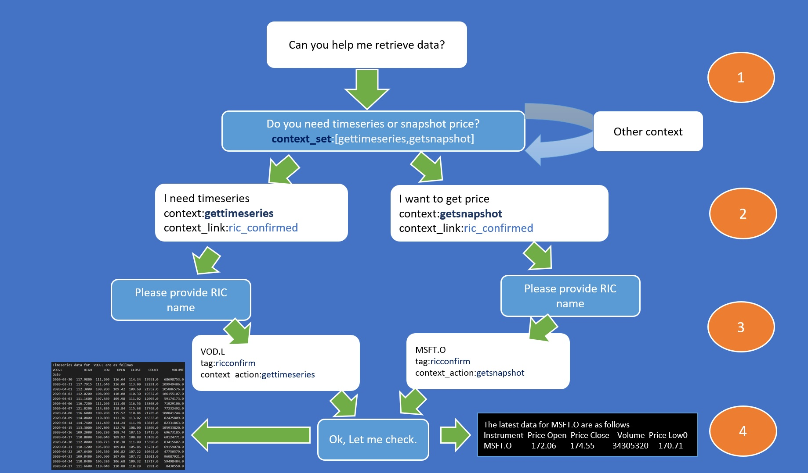
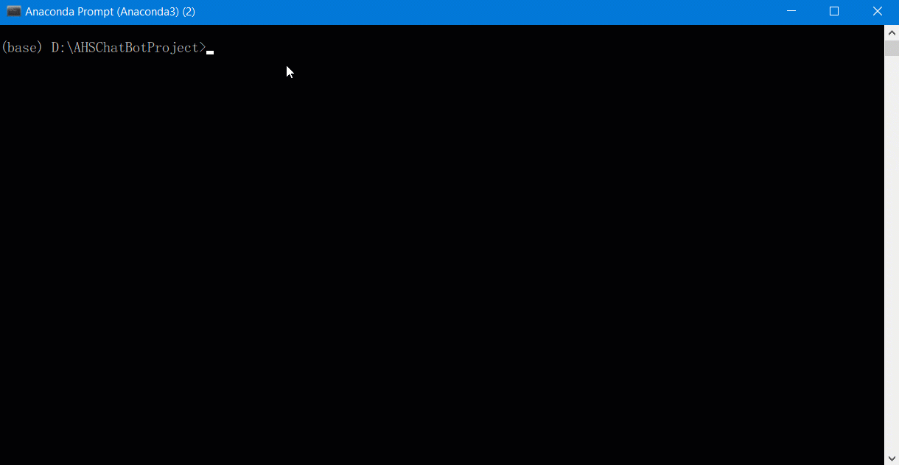
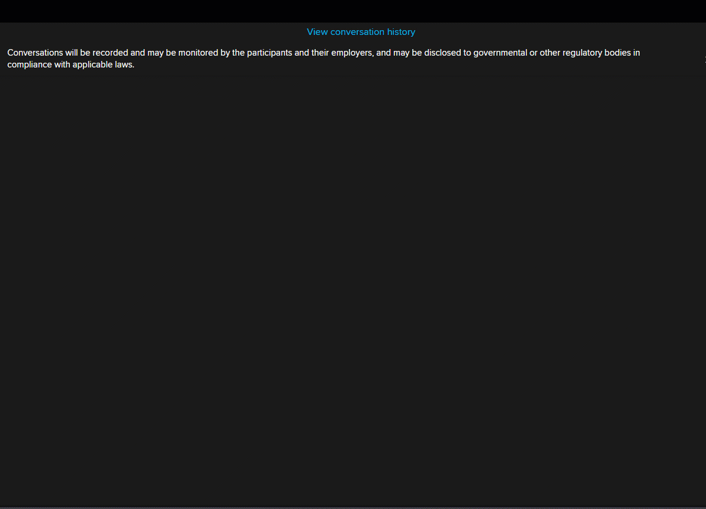

# How to build Eikon Messenger Interactive ChatBot with Python Machine Learning and Messenger Bot API | Refinitiv

## Introduction

Nowadays, Chatbots are extremely helpful for business organizations and also customers. The majority of people prefer to talk directly from a chatbox instead of calling a Helpdesks. Some of the more advanced chatbots are powered by AI, helping them to solve problems, send personalized messages, and improve their interactions over time.  It is a quick way to get their problems solved, so chatbots have a bright future in organizations. You can build a chatbot on top of the existing platforms and API. It does not look hard to study the background concepts and try to make it yourself. 

Refinitiv also provides a new [Messenger Bot API](https://developers.refinitiv.com/messenger-api/messenger-bot-api), which provides a set of available API calls to build automated workflows or
bots for Eikon Messenger. The Bot API allows your applications to connect with and pass information
into Eikon's Messenger service programmatically and also build interactive chatbots.
The Bot API includes a REST API and also provides a WebSocket to listen to events and to allow a bot to respond. All request and response bodies are encoded in JSON.

Today we are going to build our interactive Chatbot using Python with the [Messenger Bot API](https://developers.refinitiv.com/messenger-api/messenger-bot-api). We will implement a chatbot from scratch that will be able to understand what the user is talking about and give an appropriate response like below sample conversation.


Interaction Chatbot implementation main challenges are:

__Step1: Building the Deep Learning Model__

This step, we need to translate user input to recognize the intent. It can be solved with Machine Learning, and we are using Keras with TensorFlow backend in this project. We need to build a model using Keras and save it to local storage to re-use it in the main implementation of the ChatBot.

__Step 2: Integrate Model with Message Bot API__

We need to integrate implementation from steps 1 and 2 with Messenger Bot API to send and receive a message from a user's input. To make it short, we will modify the implementation of the Python example chatbot_demo_ws.py which provided in [Messenger Bot example](https://github.com/Refinitiv-API-Samples/Example.MessengerChatBot.Python) to integarte our ChatBot with original codes.

__Step3: Keep track of the conversation context__

Conversations in messaging apps often need context. If you're conversing with a customer and you refer to some data, the context is there. If you're asking for on-line support from the helpdesk to help you get some stock price/data, the representative can look it up, and again the context is there. This part is nothing much Machine Learning related here. But we need to implement Python codes to track the conversation context and link it to the appropriate conversation context in the set if required. It may not require a classification for user intents. If the context is the Bot's question, then the user input is treated as answers to chatbot questions.

# Prerequisites

* You need to installation Eikon Messenger and you should be able to login to the messenger.

* You must have Eikon Desktop running in order to test functionality to retrieve prices and get time-series data using Eikon DATA API. And you need to install Eikon Data API using

```command
pip install eikon
```

* Please read [Messenger BOT API Quick Start Guide](https://developers.refinitiv.com/messenger-api/messenger-bot-api/quick-start) and follow the instruction in the guide to setup Chat Bot account and create a chat room for the test. 

* Please read [Bot API Developer document](https://developers.refinitiv.com/messenger-api/messenger-bot-api/docs?content=81683&type=documentation_item). You need to understand the HTTP request and response message, Websocket implementation for interactive bot along with the structure of data and limitation of the API.

* Python 3.7 or above

* Download Python Example for the BOT API from [Github](https://github.com/Refinitiv-API-Samples/Example.MessengerChatBot.Python) and test chatbot_demo_ws.py example with your account. You need to modify the codes from the file to implement the ChatBot.

* Install Tensorflow and Keras module. We use TensorFlow 2.1.0 with Keras 2.3.1. Please see [Tensorflow 2 install guide](https://www.tensorflow.org/install ) and [Keras installation guide](https://keras.io/#installation).

* Install Python library by using below command. Note that if you found error when install Tensorflow or Keras, you may need to following instructure on thier website to install the libary from github.

```command
pip install ws-requirements.txt
```

# Creating ChatBot

Let start by classification model training to classify the input from the user. You can download a full Python example from [GitHub](https://github.com/Refinitiv-API-Samples/Example.MessengerBotAPI.Python.InteractiveMessengerBotML).

## Step 1: Building the Deep Learning Model

There are many popular articles describing how to use Keras and TensorFlow to create the model. And this article will apply the codes and knowledge from this [article](https://towardsdatascience.com/build-it-yourself-chatbot-api-with-keras-tensorflow-model-f6d75ce957a5)  with additional knowledge from [Keras document](https://keras.io/getting-started/sequential-model-guide/) to create a classification model.

Below is a list of Python libraries that are used in the implementation. Keras deep learning library is used to build a classification model. Keras runs training on top of the TensorFlow backend. Lancaster stemming library from NLTK package is used to collapse distinct word forms:

```python
import nltk
from nltk.stem.lancaster import LancasterStemmer
stemmer = LancasterStemmer()

# things we need for Tensorflow
import numpy as np
from keras.models import Sequential
from keras.layers import Dense, Activation, Dropout
from keras.optimizers import SGD
import pandas as pd
import pickle
import random
```
We need to create an intents file, which is a plain JSON file.No need to have a huge vocabulary. Our goal is to build a chatbot for a specific domain. The classification model can be created for small vocabulary too. It will be able to recognize a set of patterns provided for the training. Below is a sample data from ahsbot_intents.json file.

```json
{
    "intents": [
        {
            "tag": "greeting",
            "patterns": ["Hi there","How are you","Is anyone there?","Hello","Good day"],
            "responses": ["Hello, thanks for asking","Good to see you again","Hi there, how can I help?"],
            "context": [""]
        },
        ///...
        {
            "tag": "options",
            "patterns": ["How you could help me?","What you can do?","What help you provide?","What support is offered","Help"],
            "responses": ["I can help you get some data like stock price or timeseries.I can also provide some API details such as TREP API ad some Eikon Data API and provide link to download API","Offering mainly support for TREP and Elektron SDK API. Anyway I know a little bit about Eikon Data API and can help you check some price"
            ],
            "context": [""]
        },
        {
            "tag": "trepapidownload",
            "patterns": ["How to downoad RFA API?","How to downoad RFA C++ API?","How to downoad RFA Java API?","How to download Open DACS API","Give me a list of TREP API","download RFA C++","download RFA Java","download RFA.NET","List REP API"],
            "responses": ["Navigate to API of your choice from developer portal https://developers.refinitiv.com/thomson-reuters-enterprise-platform/apis-in-this-family, there is download section in each API.Note that only RDC named user can access the page."],
            "context": [""]
        },
        ///...
        {
            "tag": "get_data",
            "patterns": ["I want to retrieve data","get data","get stock data","Can you retreive data?","Can you help me get data?","Any way to get data."],
            "responses": ["I can retreive some of the timeseries data (limit to 30 days) or snapshot of stock price.\nDo you need timeseries or price?","Do you want to retreive timeseries (limit to 30 days) or price?"],
            "context": ["get_data"],
            "context_set":["gettimeseries","getsnapshot"]
        },
        {
            "tag": "gettimeseries",
            "patterns": ["I want to get timeseries","I want to get timeseries data",
                "I want to retreive timeseries","I want to retrieve timeseries data",
                "historical data","timeseries data","get timeseries data",
                "get historical data","retreive historical data"],
            "responses": ["Please provide RIC name",
                "Can you provide RIC name"],
            "context": ["gettimeseries"],
            "context_link": ["ric_confirmed"]
        },
        {
            "tag": "getsnapshot",
            "patterns": ["I want to get price","Can I get price","Can I get stock price","Can you help me get stock price","get latest price","retreive snapshot data","retrieve stock price","retrieve latest price"],
            "responses": ["Please provide RIC name","Can you provide RIC name"],
            "context": ["getsnapshot"],
            "context_link": ["ric_confirmed"]
        },
        {
            "tag": "ric_confirmed",
            "patterns": [],
            "responses": ["Let me check, please wait.","Ok, Let me check.","Roger that! Wait for a second."],
            "context": [""]
        }]
}
```

Before we could start with classification model training, we need to build vocabulary first. Patterns are processed to create a vocabulary. Each word is stemmed to produce generic root, and this would help to cover more combinations of user input:

```python
# import our chat-bot intents file
import json
with open('ahsbot_intents.json') as json_data:
    intents = json.load(json_data)

words = []
classes = []
documents = []
ignore_words = ['?']
# loop through each sentence in our intents patterns
for intent in intents['intents']:
    for pattern in intent['patterns']:
        # tokenize each word in the sentence
        w = nltk.word_tokenize(pattern)
        # add to our words list
        words.extend(w)
        # add to documents in our corpus
        documents.append((w, intent['tag']))
        # add to our classes list
        if intent['tag'] not in classes:
            classes.append(intent['tag'])
# stem and lower each word and remove duplicates
words = [stemmer.stem(w.lower()) for w in words if w not in ignore_words]
words = sorted(list(set(words)))
# sort classes
classes = sorted(list(set(classes)))
# documents = combination between patterns and intents
print (len(documents), "documents")
# classes = intents
print (len(classes), "classes", classes)
# words = all words, vocabulary
print (len(words), "unique stemmed words", words)
```

And this is the output of vocabulary creation. There are 16 intents or classes and 107 vocabulary words

```
119 documents
16 classes ['changeconfidencelevel', 'clear_context', 'eikondataapipython', 'esdkdcompat', 'esdkdotnet', 'esdkdownload', 'esdkinfo', 'get_data', 'getsnapshot', 'gettimeseries', 'goodbye', 'greeting', 'options', 'thanks', 'trepapidownload', 'trepesdkapi']
107 unique stemmed words ['#', "'s", ',', '.', '.net', '4.x', 'a', 'ad', 'adh', 'adjust', 'al', 'any', 'anyon', 'ap', 'ar', 'awesom', 'be', 'bye', 'c', 'c++', 'can', 'chang', 'chat', 'clear', 'confid', 'context', 'could', 'dac', 'dat', 'day', 'desktop', 'do', 'downalod', 'download', 'downoad', 'eikon', 'elektron', 'em', 'esdk', 'et', 'for', 'from', 'gcc', 'get', 'github', 'giv', 'good', 'goodby', 'hello', 'help', 'hi', 'hist', 'how', 'i', 'is', 'jav', 'lat', 'latest', 'level', 'linux', 'list', 'me', 'next', 'nic', 'of', 'off', 'ok', 'on', 'op', 'os', 'plan', 'pric', 'provid', 'publ', 'python', 'real', 'reset', 'retreiv', 'retriev', 'rfa', 'rfa.net', 'rhel7', 'sdk', 'see', 'snapshot', 'stock', 'support', 'thank', 'that', 'ther', 'til', 'tim', 'timesery', 'to', 'trep', 'ubuntu', 'up', 'us', 'vert', 'want', 'way', 'what', 'wher', 'which', 'window', 'with', 'you']
```

We need to convert words into bags of words with arrays containing 0 or 1. Array length will be equal to vocabulary size and 1 will be set when a word from the current pattern is located in the given position:

```python
# create our training data
training = []
# create an empty array for our output
output_empty = [0] * len(classes)
# training set, bag of words for each sentence
for doc in documents:
    # initialize our bag of words
    bag = []
    # list of tokenized words for the pattern
    pattern_words = doc[0]
    # stem each word - create base word, in attempt to represent related words
    pattern_words = [stemmer.stem(word.lower()) for word in pattern_words]
    # create our bag of words array with 1, if word match found in current pattern
    for w in words:
        bag.append(1) if w in pattern_words else bag.append(0)
    
    # output is a '0' for each tag and '1' for current tag (for each pattern)
    output_row = list(output_empty)
    output_row[classes.index(doc[1])] = 1
    
    training.append([bag, output_row])
# shuffle our features and turn into np.array
random.shuffle(training)
training = np.array(training)
```

Training data — X (pattern converted into array [0,1,0,1…, 0]), Y (intents converted into array [1, 0, 0, 0,…,0], there will be single 1 for intents array). 

```python
# create train and test lists. X - patterns, Y - intents
train_x = list(training[:,0])
train_y = list(training[:,1])
```

Refer to details from [Keras document](https://keras.io/models/model/); we will use Keras Sequential to built a Model based on three layers. Note that from the test, three layers seem to return useful results depends on training data. Classification output will be multiclass array, which would help to identify encoded intent—using softmax activation to produce multiclass classification output (result returns an array of 0 or 1: [1,0,0,…,0] — this set identifies encoded intent). We will set DropOut to 0.5. DropOut is a simple way to prevent neural networks from overfitting during training times.

```python
# Create model - 3 layers. First layer 128 neurons, second layer 64 neurons and 3rd output layer contains number of neurons
# equal to number of intents to predict output intent with softmax
model = Sequential()
model.add(Dense(128, input_shape=(len(train_x[0]),), activation='relu'))
model.add(Dropout(0.5))
model.add(Dense(64, activation='relu'))
model.add(Dropout(0.5))
model.add(Dense(len(train_y[0]), activation='softmax'))
```
Compile Keras model with [SGD optimizer](https://keras.io/optimizers/#sgd):
```python
# Compile model. Stochastic gradient descent with Nesterov accelerated gradient gives good results for this model
sgd = SGD(lr=0.01, decay=1e-6, momentum=0.9, nesterov=True)
model.compile(loss='categorical_crossentropy', optimizer=sgd, metrics=['accuracy'])
```
And then Fit the model by execute training and construct classification model. We are executing training in 200 iterations, with batch size = 5:
```python
# Fit the model
model.fit(np.array(train_x), np.array(train_y), epochs=200, batch_size=5, verbose=1)
```
This time the model is built. Now we will use two helper functions from original sample codes. Function bow helps to translate user sentences into a bag of words with arrays of 0 or 1. When the function finds a word from the sentence in chatbot vocabulary, it sets 1 into the corresponding position in the array. This array will be sent to be classified by the model to identify to what intent it belongs. 

We will save the trained model into a pickle file to be able to reuse it in our ChatBot app.

```python

# save model to file
pickle.dump(model, open("ahsbot-model.pkl", "wb"))

# save all of our data structures
pickle.dump( {'words':words, 'classes':classes, 'train_x':train_x, 'train_y':train_y}, open( "ahsbot-data.pkl", "wb" ) )

```
You can find a full python code to train the bot from __traindata.py__ file. You need to run it to re-train the bot when you add data to the intents file.

## Step 2: Integrate Machine Learning Model with Message Bot API

We need to create a function to classify user input based on calculated probability. We will define a threshold to filter the intent in the result. Multiple intents can be returned. 

```python
#Use pickle to load  data
data = pickle.load( open( "ahsbot-data.pkl", "rb" ) )
words = data['words']
classes = data['classes']

#Use pickle to load in the pre-trained model
with open('ahsbot-model.pkl', 'rb') as f:
    global model
    model = pickle.load(f)

def classify(sentence):
    # Add below two lines for workaround error _thread._local' object has no attribute 'value'
    import keras.backend.tensorflow_backend as tb
    tb._SYMBOLIC_SCOPE.value = True
   
    global model
    global confidence_level
    ERROR_THRESHOLD = confidence_level
    # generate probabilities from the model
    input_data = pd.DataFrame([bow(sentence, words)], dtype=float, index=['input'])
   
    results = model.predict([input_data],workers=1,verbose=1)[0]
  
    # filter out predictions below a threshold, and provide intent index
    results = [[i,r] for i,r in enumerate(results) if r>ERROR_THRESHOLD]
    # sort by strength of probability
    results.sort(key=lambda x: x[1], reverse=True)
    return_list = []
    for r in results:
        return_list.append((classes[r[0]], str(r[1])))
    # return tuple of intent and probability 
    return return_list
```

Next step, we will create a botResponse method and then use the classify function to get a result and provide a response back to a user.


```python
def botResponse(sentence, userID):
    import random
    tagResult = classify(sentence)
    if not tagResult:
        return "Sorry, I do not understand"
    responseList = list(filter(lambda x:x['tag'] == tagResult[0][0],intents['intents']))
    return random.choice(responseList[0]['responses'])
```

Test the method: 

```python
message='Can I use EMA with .NET?'
print("User:",message)
print("Bot:",botResponse(message,userId))

message='Where can I download RFA C++?'
print("User:",message)
print("Bot:",botResponse(message,userId))
print(context)
```
It will return the sentence from the ahsbot-intents.json file which matches with intents returned from our Model.

```
User: Can I use EMA with .NET?
Bot: Currently Elektron SDK(ESDK) does not support .NET. Only C++ and Java version available on https://github.com/Refinitiv/Elektron-SDK or https://developers.refinitiv.com/elektron/apis-in-this-family
```

```
User: Where can I download RFA C++?
Bot: Navigate to API of your choice from developer portal https://developers.refinitiv.com/thomson-reuters-enterprise-platform/apis-in-this-family, there is download section in each API.Note that only RDC named user can access the page.

```

Next steps, it's time to integrate the botResponse method to the Messenger BOT API example app. 

If you would like to have an interactive Bot, then you will need to establish a WebSocket connection. The WebSockets are used to provide a persistent connection between two endpoints. They allow for access to real-time communication and will enable a bot to listen for events to create a more interactive bot. We will not describe the steps to establish a WebSocket connection in this article. Please refer to [Messenger Bot API document](https://developers.refinitiv.com/messenger-api/messenger-bot-api/docs?content=81683&type=documentation_item) section WebSocket Connection for more details about the WebSocket implementation and limitation.

Instead of creating a new application from scratch, we will create a new file ahsbot_demo_ws.py and copy original codes from chatbot_demo_ws.py, which is an example implemented for Messenger Bot WebSocket connection. Then we will modify the codes from ahsbot_demo_ws.py to use our Chatbot when it sends a response back to the user. It will call our botResponse function instead. You need to modifying function process_message. It used to process a message from Websocket Client 
__on_message__ callback.

```python
web_socket_app = websocket.WebSocketApp(
        ws_url,
        on_message=on_message,
        on_error=on_error,
        on_close=on_close,
        subprotocols=['messenger-json'])
def on_message(_, message):  # Called when message received, parse message into JSON for processing
    print('Received: ')
    message_json = json.loads(message)
    print(json.dumps(message_json, sort_keys=True, indent=2, separators=(',', ':')))
    process_message(message_json)

# Process incoming message from a joined Chatroom
def process_message(message_json):
    message_event=message_json['event']
    if message_event == 'chatroomPost':
        try:
            incoming_msg = message_json['post']['message']
            sender = message_json['post']['sender']['email']
            resp_msg='@'+sender+' '+botResponse(incoming_msg,sender)
            post_message_to_chatroom(access_token, joined_rooms, chatroom_id,resp_msg)
        except Exception as error:
            print('Post meesage to a Chatroom fail :', error)
```
Below is a test result when running modified codes with BILATERAL chatroom.


We are now successfully integrated our Model to the interactive Messenger BOT API.

## Step 3: Keep track of the conversation context

The last steps we need to handle the context flow between ChatBot and user. There is the scenario that the question may require additional input from user inorder to flow to the next conversation. 

Check the following sample JSON data, you should see some object has context_set and context_link tag.

```json
       {
            "tag": "get_data",
            "patterns": ["I want to retrieve data","get data","get stock data","Can you retreive data?","Can you help me get data?","Any way to get data."],
            "responses": ["I can retreive some of the timeseries data (limit to 30 days) or snapshot of stock price.\nDo you need timeseries or price?",
                "Do you want to retreive timeseries (limit to 30 days) or price?"],
            "context": ["get_data"],
            "context_set":["gettimeseries","getsnapshot"]
        },
        {
            "tag": "gettimeseries",
            "patterns": ["timeseries",
                 ///...
                "get historical data","retreive historical data"
            ],
            "responses": ["Please provide RIC name","Can you provide RIC name"],
            "context": ["gettimeseries"],
            "context_link": ["ric_confirmed"]
        },
        {
            "tag": "getsnapshot",
            "patterns": ["I want to get price","Can I get price",
                ///...
                "retrieve stock price","retrieve latest price"],
            "responses": ["Please provide RIC name","Can you provide RIC name"],
            "context": ["getsnapshot"],
            "context_link": ["ric_confirmed"]
        },
        {
            "tag": "ric_confirmed",
            "patterns": [],
            "responses": ["Let me check, please wait.","Ok, Let me check.","Roger that! Wait for a second."],
            "context": [""]
        }
```
The context_set is a set of context which could be an answer to the question. Thus the query from the user must match one of the contexts in the context_set. The context_link is the next conversation context that the Bot has to respond in case that the Bot already received input from a user.

The below diagram is a sample scenario based on the JSON data. The white box in user input and blue box is for a BOT response.



There are four orange bullets, each bullet represent situation of the conversation context.

* __Bullet1__ 
    There is a conversation when the client wants to retrieve some data. The Bot will reply with a choice. This Bot can help the user retrieving either time-series data or snapshot price. So it has to ask a user to confirm the usage. 

* __Bullet2__
    User input answer. The Bot may repeat the question if the context of the answer is not in the context_set.

* __Bullet3__ 
    The context of the answer is in context_set. Therefore, Bot asks a user to provide a RIC name. The user provides an answer, and Bot will assume that the input is RIC name. It will create context_action, which is an internal command for the app. App also checks if the JSON object contains context_link, it will search for a tag which matches with the value of context_link. Then it has to send the response back to the user.

* __Bullet4__ 
    The app will check the context_action and call an internal function to retrieving the data or do other actions. I don't' want to make it more complicated; therefore, our example call function from Eikon Data API to get price or time-series data accordingly.

We will add additional logics to handle the conversation context so you can find a complete code with new app logics from the ahsbot_demo_ws.py file.

Below is a sample chat log after updating the codes to handle the conversation context.


The additional implementation is beneficial in case you need to get input from the user and run an internal function or call external service to get some other data and return to the user.

## Running ChatBot

Please download full ChatBot project from [GitHub](https://github.com/Refinitiv-API-Samples/Example.MessengerBotAPI.Python.InteractiveMessengerBotML)

Note that currently, the Chatbot app was designed to works with Bilateral Chatroom only. The following steps have been applied to the application to test your Messenger Account with Messenger Bot API.

1) Load Model
2) Get RDP Token and share the token among the app
3) Check whether the Bilateral Chatroom Name is on the ChatRoom List. If the Chatroom was not created, create a new one. Then get a Chatroom ID from the list.
4) Bot join Chatroom using the Chatroom ID.
5) Bot invite a user to join the Chatroom using the recipient email.
6) Bot sends a welcome message to Chatroom.
7) The bot connects to the Websocket server to monitoring messages from Chatroom and responds when receiving a new message.

There are two files you need to run.

* traindata.py is a Python script to train ChatBot, generate Model and save the data and model to files. The project already contains pre-built data(ahsbot-data.pkl) and model(ahsbot-model.pkl) so you don't need to run it again unless you want to modify or add sentence and data to ahsbot_intents.json. 

  You can run the script by executing the following command
  ```command
  python traindata.py
  ```
  It will run Tensorflow to create model and save to file like following output.

  

* ahsbot_demo_ws.py is a main ChatBot app. 
Modify the following section in the Python codes. Change it to your account.

```python
# Input your Bot Username
bot_username = 'bot_agent.<User>@<compnay.com>'
# Input Bot Password
bot_password = '<Your BOT Password>'
# Input your Messenger account AppKey.
app_key = '<Your Bot AppKey>'

# Input your Eikon Data API AppKey
eikon_data_api_app_key = "Eikon Data API AppKey"
# Input your Messenger Application account email
recipient_email = ['<recipient email address>']

# Input BILATERAL Chat Room name
bilateral_chatroom_name = "<name of BILATERAL chatroom you want to create>"
```
You can set the following parameter to __False__ in case that you don't have Eikon Desktop to test. The Bot will generate Dummy data when you retreive the price.
```python
use_data_from_eikon =True
```
Please make sure that you have data and model files(ahs-data.pkl and adhsbot-model.pkl) including ahsbot-intense.json in the same folder before executing the following command.
  ```command
  python chatbot_demo_ws.py
  ```
You will see the following output when the Message BOT API connected to the server.


The Eikon Messenger will pop up welcome message we just sent to the Chatroom like the following screen shot.


You can type 'bye' to left the Chatroom. The app will remove your account from participant list and shows message like the following screen shot.


Below is sample output when testing Eikon Messenger with the ChatBot.



# Conclusion

In this article, we have explained steps to build your Interactive ChatBot with Python Machine Learning and Messenger Bot API. There is more room to play, you may add a queue to queuing and processing the message and you can integrate the core logics of ChatBot to web framework such as [Flask](https://www.fullstackpython.com/flask.html) to create Bot server. Moreover, you can create your Chatbot using other Python libraries such as ChatterBot, or you can apply a technologies/frameworks like [Microsoft Bot Framework](https://dev.botframework.com/),[IBM Watson](https://www.ibm.com/watson) or using [Google Dialog Flow](https://dialogflow.com/) to implement the Bot. Then you can integrate your Bot system with Refinitiv Message Bot API using any programming language which provides HTTP Client library and Websocket Client library. You can incorporate the functionality of the other Refinitiv's APIs to retrieve particular information as well.

The future of Chatbots is very bright with the advancement in the Artificial Intelligence sector. Future Chatbot will not only be customer support; it will be an advanced assistant for both the business and the consumer. AI Chatbot will take over repetitive and tedious tasks on behalf of a human. The Chatbot that we just built is quite simple, but this example should help you think through the design and challenge of creating your own Bot.


# References

* [Messenger Bot API](https://developers.refinitiv.com/messenger-api/messenger-bot-api)
* [Messenger Bot example](https://github.com/Refinitiv-API-Samples/Example.MessengerChatBot.Python)
* [Messenger Bot API document](https://developers.refinitiv.com/messenger-api/messenger-bot-api/docs?content=81683&type=documentation_item)
* [Keras GitHub Examples](https://github.com/keras-team/keras/tree/master/examples)
* [Getting started with the Keras Sequential model](https://keras.io/getting-started/sequential-model-guide/)
* [Build it Yourself — Chatbot API with Keras/TensorFlow Model](https://towardsdatascience.com/build-it-yourself-chatbot-api-with-keras-tensorflow-model-f6d75ce957a5) 
* [Eikon Data API](https://developers.refinitiv.com/eikon-apis/eikon-data-api)
* [Natural Language Toolkits-NLTK](https://www.nltk.org/)